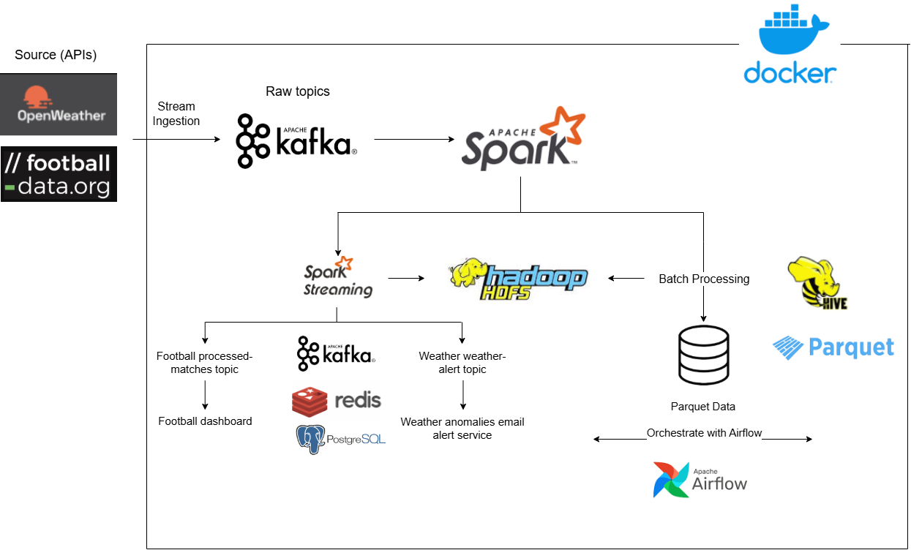
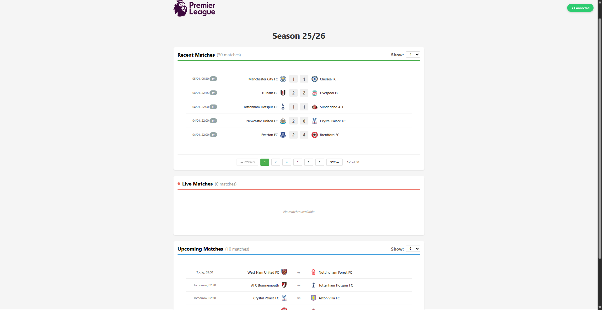
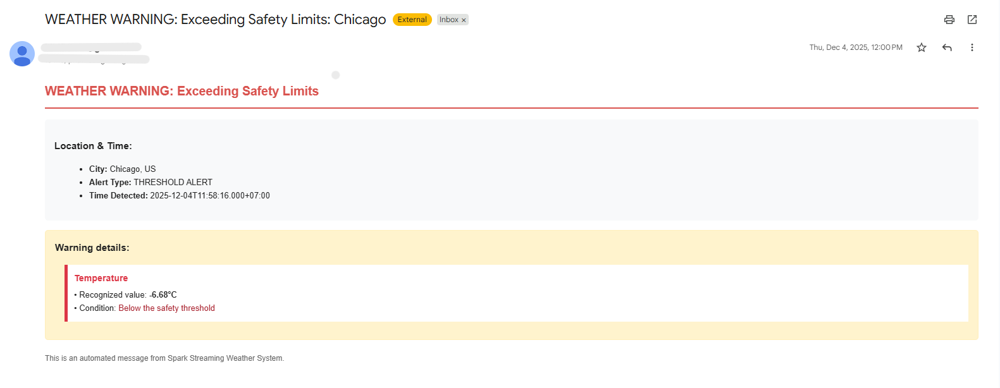

# Hadoop-Kafka-Spark Comprehensive Data Pipeline

This project implements a comprehensive real-time data streaming and batch processing pipeline that ingests, processes, and analyzes data from multiple sources (OpenWeather API and football-data.org) using modern big data technologies.



## Tech Stack
- **Storage**: Apache Hadoop HDFS 
- **Data Warehouse**: Apache Hive (Metastore on PostgreSQL)
- **Event Backbone**: Apache Kafka + Schema Registry
- **Processing Engine**: Spark 
- **Orchestration**: Apache Airflow 
- **Real-time Store**: Redis (Caching & Dashboard backend)
- **Database**: PostgreSQL (Metadata & Airflow backend)
- **Monitoring**: Kafka UI, Spark UI, HDFS Web UI
- **Container**: Docker & Docker Compose

## Code layout

- `src/ingestion/api/batch.py` and `src/ingestion/api/streaming.py`: Ingestion entrypoints.
- `src/streaming/*`: Streaming consumers and email alert consumer.
- `src/batch/*`: Batch processors intended to be invoked by Airflow tasks.
- `src/schema`: Avro schema files for data validation.

## Prerequisites

- Docker and Docker Compose (Docker Desktop recommended)
- Node.js + npm (for the dashboard)
- Python 3.10 (for local development outside containers, optional)
- API keys for external services (provided in .env.example)
- Before running the project, download the following binaries and place them in the root directory of your project. You can use `wget` to download them directly:

  - **Apache Hive 2.3.2**  
  ```bash
  wget https://archive.apache.org/dist/hive/hive-2.3.2/apache-hive-2.3.2-bin.tar.gz
  ```
  - **Apache Hadoop 3.3.6**
  ```bash
  wget https://archive.apache.org/dist/hadoop/common/hadoop-3.3.6/hadoop-3.3.6.tar.gz
  ```
  - **Apache Spark 3.5.0**
  ```bash
  wget https://archive.apache.org/dist/spark/spark-3.5.0/spark-3.5.0-bin-hadoop3.tgz
  ```


## Quick Start

1. Clone the repo

```bash
git clone <your-repo-url> my-data-pipeline
cd my-data-pipeline
```

2. Setup environment variables
```bash
cp .env.example .env
# Edit .env with your API keys and Email configs
```

3. Bring up the platform 

```bash
# Start all services in detached mode
docker-compose up -d

# Wait until all services are running
```

4. Start data ingestion

```bash
# Start ingestion components
./scripts/start-ingestion.sh
```

5. Football dashboard
```bash
# Start football streaming 
./scripts/start-football-streaming.sh

# Dashboard
cd football-dashboard
npm start

# Access dashboard at http://localhost:3001/dashboard.html
```

6. Weather email alert
```bash
# Start weather streaming
./scripts/start-weather-streaming.sh

# Start email alert service
./scripts/start-email-alert.sh
```



## Access service UIs (HDFS, Kafka, Airflow)
- HDFS (NameNode UI):
  - URL: http://localhost:9870
  - Purpose:
    - Browse HDFS directories (Bronze / Silver / Gold layers)
    - Check file sizes, replication, and HDFS health


- Kafka UI:
  - URL: http://localhost:8085
  - Purpose:
    - View topics (weather, football, processed topics)
    - Inspect messages and consumer groups
    - Monitor lag and throughput

- Airflow Web UI:
  - URL: http://localhost:8083
  - Purpose:
    - Monitor DAGs and task execution
    - Check logs for ingestion and processing jobs
    - Manually trigger or backfill DAGs


